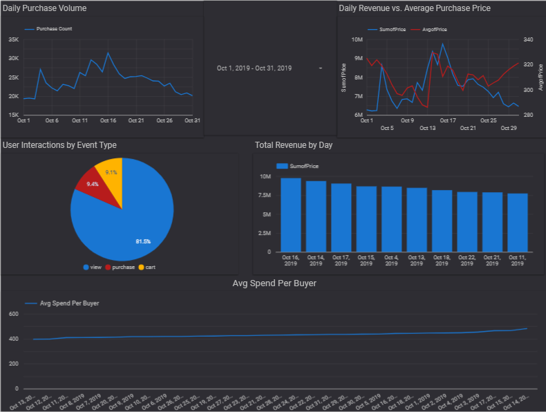
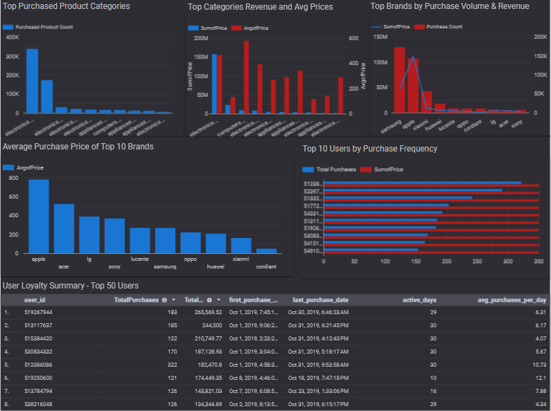

# Cloud-Based Data Analysis – October 2019 eCommerce Insights

This repository contains a comprehensive cloud-based data analysis project focused on eCommerce user behavior and sales performance for **October 2019**. The project leverages **Google BigQuery** for data processing and **Looker Studio** for interactive visualizations.

---

## Repository Structure

The project is organized into the following folders, each with detailed SQL queries and README documentation:

- `daily_purchase_analysis/`  
  Analyzes daily purchase counts, revenue trends, and average purchase prices.

- `hourly_purchase_trends/`  
  Examines purchase volume and revenue patterns by hour of day.

- `product_category_brand_analysis/`  
  Provides insights on top product categories, revenue contributions, and brand performance.

- `purchase_price_distribution/`  
  Explores average, minimum, and maximum purchase prices with notable daily fluctuations.

- `top_users_purchase_behavior/`  
  Profiles the top 100 users by purchase frequency and spending.

- `user_funnel_summary_by_event_type/`  
  Calculates unique user counts for key events (view, cart, purchase) to understand user engagement.

- `user_interaction_funnel/`  
  Analyzes conversion rates across the shopping funnel stages: views → carts → purchases.

- `visualizations/`  
  Contains PNG screenshots of Looker dashboards:  
  - `sales_user_activity_summary.png`  
  - `top_brands_loyal_customers.png`

---

## Key Insights & Dashboards

Two Looker Studio dashboard pages summarize the main findings:

### Sales & User Activity Summary  
- Daily purchase trends and revenue fluctuations  
- User engagement across key events  
- Hourly purchase behavior highlighting peak times and spending patterns  

### Top Brands & Loyal Customers  
- Leading product categories and brands by sales and revenue  
- Detailed profiles of loyal, high-value customers  
- Insights useful for targeted retention strategies  

---

## How to Reproduce or Extend

1. Use the SQL queries within each folder to reproduce analyses in your own BigQuery environment.  
2. Review the README files in each folder for detailed explanations of methodologies.  
3. Explore the `visualizations` folder for static previews of Looker dashboards.  
4. Connect Looker Studio to BigQuery to build or customize interactive dashboards using the provided queries.

---

## Preview of Dashboards

| Sales & User Activity Summary                              | Top Brands & Loyal Customers                               |
|------------------------------------------------------------|------------------------------------------------------------|
|  |  |

---
## Dataset Source

The data used in this project comes from the publicly available Kaggle dataset:  
📦 [eCommerce Behavior Data from Multi-category Store](https://www.kaggle.com/datasets/mkechinov/ecommerce-behavior-data-from-multi-category-store)  
Published by: Mikhail Kechinov

## Contact

For questions, feedback, or contributions, please feel free to reach out:

- Email: tepegozersin@gmail.com  
- LinkedIn: [linkedin.com/in/tepegozersin](https://www.linkedin.com/in/ersin-tepeg%C3%B6z-8710ab366/)

---

*This project showcases how cloud data warehousing and BI tools can be combined to extract actionable insights from large-scale eCommerce data.*
